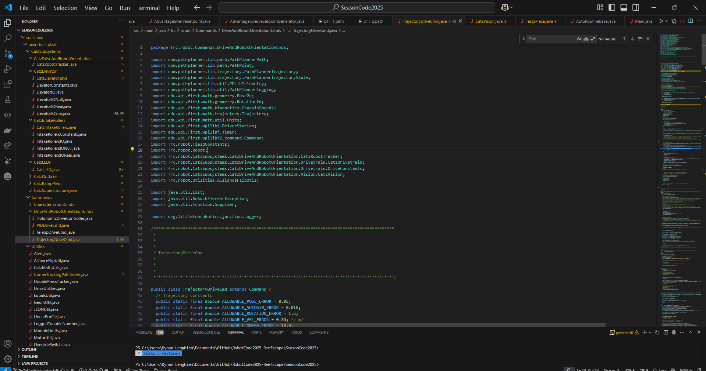

# WPIlib and Associated Tools

This section covers a brief overview of the WPILIB program and tools you will use as part of the WPIlib installation.

## Installation
Follow the instructions on the [official WPILib installation guide](https://docs.wpilib.org/en/stable/docs/zero-to-robot/step-2/wpilib-setup.html). Keep the below tips in mind for quality of life during the installation.

- You should be aware of the version year you are downloading. WPILIB releases alpha and beta versions for upcoming years that can be confused as the latest version. Download the latest stable release of WPILIB for your year.
- Because the WPILib installer is a large file, if you need to install it on multiple computers, consider downloading it once and transferring it via a USB drive. This can save time and bandwidth during the installation process.

- **"WPILib VSCode vs VSCode":** WPILib uses its own version of VSCode that contains plugins specific for FRC, enabling you to build and use WPILib templates. Do not confuse this with a preexisting installation of VSCode.

## VS Code Exploration

Wpilib vscode is where you will spend the majority of your coding time as an FRC programmer. Hre are some key layout features to take note of

- Project Explorer - Blue: Shows how your robot code project is organized. In order for your code to be deployable to the robot.

### Tips for programming in WPILIB Vscode enviroment

## WPILIB tools

WPILib includes many other tools that are helpful in robot programming. The most commonly used tools will be mentioned here:

### Generally Used WPILIB programs

- [**AdvantageScope**](https://docs.advantagescope.org/): Visualizes and analyzes robot log data for debugging and performance review.
- [**Elastic**](https://frc-elastic.gitbook.io/docs): A tool for managing and visualizing log data, often used with AdvantageScope.
- **roboRIO Team Number Setter**: Sets the team number on the roboRIO controller.
- **SmartDashboard**: Another dashboard tool for displaying and controlling robot data.
- **SysId**: System identification tool for characterizing robot mechanisms.

### Less Commonly Used Programs

The WPILib suite also includes several programs that are less frequently used in typical FRC workflows. While these tools may be helpful for specific tasks or advanced troubleshooting, most teams will not need them for typical robot programming applicaitons.

- **Data Log Tool**: Records and manages data logs from your robot for later analysis.
- **Glass**: A real-time dashboard for monitoring robot variables and network tables.
- **OutlineViewer**: Views and edits NetworkTables entries in real time.
- **PathWeaver**: Designs and exports autonomous robot paths for use in code.
- **RobotBuilder**: Generates robot code structure based on a graphical subsystem and command layout.
- **Shuffleboard**: Customizable dashboard for displaying robot data and controls. (Replaced by Elastic)
- **WPIcal**: Utility for generating CAN device configuration files.
- **Java Development Kit**: Required for developing and running Java-based robot code.
