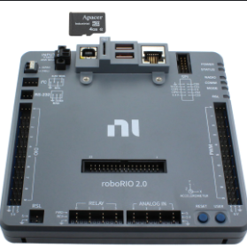

# National Instruments Game Tools/How To Connect To Robot Guide

The National Instruments (NI) Game Tools are essential software packages used in the FIRST Robotics Competition (FRC) to configure, manage, and operate your robot's control system. It provides the necessary utilities for communication between your driver station and the robot, as well as for imaging and firmware updating the roboRIO.

>**Note:** RoboRIO is the term used to describe the central computer that runs your code project on your FRC robot. A picture of it is shown below.

## How to Download

1. Visit the official NI Game Tools download page:  
    [https://www.ni.com/en/support/downloads/drivers/download.frc-game-tools.html?#553883](https://www.ni.com/en/support/downloads/drivers/download.frc-game-tools.html?#553883)
2. Select the appropriate version for your competition year.
3. Create an NI account
    - >**Note:** You will need to log in for every instance you download Game Tools onto a different computer for your team. It is recommended to have a team account and password to make the setup of multiple computers easier. 
4. Follow this guide [WPILib Game Tools Installation Guide](https://docs.wpilib.org/en/stable/docs/zero-to-robot/step-2/frc-game-tools.html) for installation.

## How the Game Tools Work

### FRC Driver Station:

 The main interface for controlling your robot during matches and practice. It manages robot communication, enables/disables the robot, and displays diagnostic information.

 In order to properly connect to your robot using this application, you must either:
 - Connect a radio

#### Key Features

Below are some common options/features you can interact with on driver station. We will purposely omit certain features for simplicity. You can find all Driverstation features on the linked reference at the bottom of this section.

- **Teleop/Autonomous "Top Right" Buttons**: Selects the robot mode.  
    - *Teleop*: Manual control by drivers.
    - *Autonomous*: Runs pre-programmed routines.

> **Note:** FRC game matches typically run intially 15 seconds autonomous(full-robot control), followed by 2:30 seconds telop period (hybrid human/robot control). Wpilib will provide you a space to write separate code for each, and as shown above, driverstation will enable you to test each section as its own part.

- **Communications/Robot Code Indicators "Middle 3 Waffle" Icons**: Show status of robot connection and code execution.
    - You absolutely need to have Communcations and Robot Code Green in order to enable your robot. If you want to be able to control your robot with a joystick, the joysticks bar should be green.
    - If Communications is red, it's most likeley a radio or printer cable issue. In some cases it may have to do with a incompatible usb driver on your laptoop

- **Enable/Disable**: Activates or deactivates robot outputs. The robot must be enabled to operate motors and actuators.

- **Team Number Entry**: Sets the team number for network communication.
    - **Important:** Please set this before connecting to your robot, or else your robot will not connect.

- **Joystick/Controller Setup TAB**: Configure and test input devices.

- **Diagnostics TAB**: Access to detailed system status and troubleshooting tools.

### Key Shortcuts

Below are some common keyboard shortcuts you should know to properly use Driverstation.

- **Enter -> Robot Disable** Disables robot outputs.

- **Space Bar -> Emergency Stop (E-Stop)**: Immediately disables all robot outputs for safety.
    - >**Note** This will require you to redeploy robot code after use. Use accordingly with that in mind. 

- **Restart Robot Code**: Restarts the user code running on the roboRIO.

- **Log File Controls**: Start and stop recording of driver station logs.

For more detailed information and a full list of features of driver station, see the [WPILib Driver Station Documentation](https://docs.wpilib.org/en/stable/docs/software/driverstation/driver-station.html).

### roboRIO Imaging Tool:

Used to format and update the roboRIO controller with the latest firmware and software images required for competition.

- Open the Imaging Tool from the NI Game Tools suite.
- Connect your roboRIO to your computer via USB or Ethernet.
- Select your roboRIO device in the tool.
- Choose the correct image for your competition year and click "Apply" to update the controller.

For a more detailed explanation, refer to the [WPILib roboRIO Imaging Guide](https://docs.wpilib.org/en/stable/docs/zero-to-robot/step-3/imaging-your-roborio.html).

