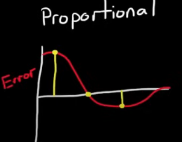

# PID Control


!!! warning
    tycho - need some short paragraph explaining what "control theory" is and some basic terms before jumping straight into PID - this page is about PID and its implementation

    Control theory is the study of how to make systems behave in a desired way by automatically adjusting their inputs based on feedback. As described in the CERN lecture notes, "Control theory deals with the problem of manipulating the inputs to a system to obtain the desired effect on the output of the system." In robotics, this means using sensors to measure what the robot is doing and then adjusting motors or actuators to reach a goal. Key terms include "system" (the thing being controlled), "input" (what you can change), "output" (what you want to achieve), and "feedback" (information about the current state). Control theory provides the mathematical and practical foundation for techniques like PID control, which is widely used in robotics and automation.


[Reference material: CERN lecture notes on control theory (PDF)](https://cds.cern.ch/record/1100534/files/p73.pdf)

## Overview

This guide teaches you the basics to get your position/velocity based elevator/pivot/flywheel/extending tube mechanisms moving accurately and covers why these systems work and are so wildly used.

**What you'll build:** A position-controlled mechanism (arm, elevator, etc.) that smoothly moves to target positions.

---

## 1. Why PID?

Let us consider an example. We have a robot, and we want to drive ten feet. We have encoders that tell us how many feet our robot has driven, and motors that we can send a percentage power to. How do we achieve our goal?

!!! warning
    tycho -  manual control needs to be differentiated from bangbang- its open loop, and shouldn't look at encoders

### Manual Control
One way to approach this problem is through a predetermined manual effort. Through trial and error, we may determine that we need to give the motors 50% power for one and a half seconds to reach our goal of 10 feet. 

!!! warning
    tycho - i feel like an interactive demo would do really well here to help build intuition with these different models. it's programming.. we should be able to do better. 
```java
while(time < 1.5) {
    motor.set(0.5); // Full speed regardless of position
}
```
That's great! However, this method isn't adaptable to any variation. If we put a cone in front of the robot, it will be slowed down and go nine feet. If we remove a mechanism from the robot, it becomes lighter, and thus moves faster, and now goes 11 feet. 

If we want the robot to go 20 feet, we can't just double the time, because acceleration and velocity vary. It would require a whole new set of tests.

### Bang-Bang Control
Bang-bang tries to incorporate some sensor feedback by switching our control effort to on or off depending on which side of the target we're on.

Imagine you're trying to boil a pot of water. You'd turn the stove on high heat to raise the temperature quickly, and then once it's boiling, you turn it off. In this scenario, Bang-Bang is _optimal!_

```java
if (currentPositionFt < 10) {
    motor.set(1.0); // full speed
} else {
    motor.set(0); // stop
}
```

In our robot scenario, robot will keep pushing even if we try to slow it down until it reaches the target. But there is a fatal flaw with this design. Unlike in our boiling scenario, the robot carries _momentum_. This means that the robot will continue to move, even after we stop applying control effort, leading to what is known as _overshoot._

Still, Bang-Bang is applicable in many scenarios where the mechanism variable doesn't have momentum (like a motor powering a flywheel), or if the mechanism has a tendency to return to its original state (like an elevator that has tendency to fall due to gravity). Mostly, Bang-Bang is implemented because its simple. In FRC however, we can do much better.

<details>
    <summary> ▶ What else is wrong with Bang-Bang? </summary>
    While bang-bang control can be good for some mechanisms like flywheels, it leads to jerky, abrupt movements that make it difficult to stop precisely at the target, which can increase wear on mechanical parts over time.

</details>


### PID's Smart Solution

We can be a lot smarter with our control. Let's say for the sake of understanding that you're driving a car, and you want this car to move exactly 100 feet. How would you achieve that?

<div class="pid-simulator" id="distance-control-sim">
  <div class="header">
    FRC Distance Control Simulator - Navigate to Target (50m away)
  </div>
  <div class="content">
    <div class="controls">
      <button class="reset-btn" onclick="resetDistanceControlSim()">Reset</button>
      <div class="manual-controls">
        <button onclick="manualDistanceControl(-1.0)">◀ Backward</button>
        <button onclick="manualDistanceControl(0)">⏸ Pause</button>
        <button onclick="manualDistanceControl(1.0)">▶ Forward</button>
      </div>
    </div>
    <div class="field-display" id="distance-field-display">
      <div class="field-markers">
        <div class="distance-marker" style="left: 0%;">0m</div>
        <div class="distance-marker" style="left: 20%;">10m</div>
        <div class="distance-marker" style="left: 40%;">20m</div>
        <div class="distance-marker" style="left: 60%;">30m</div>
        <div class="distance-marker" style="left: 80%;">40m</div>
        <div class="distance-marker" style="left: 95%;">50m</div>
      </div>
      <div class="distance-line"></div>
      <div class="robot-block" id="distance-robot">🤖</div>
      <div class="target" id="distance-target">🎯</div>
      <div class="status-display" id="distance-status-display">
        Position: 0.0m<br>
        Distance to Target: 50.0m<br>
        Speed: 0.0<br>
        Status: Stopped
      </div>
      <div class="success-message" id="distance-success-message">
        🎉 TARGET REACHED! 🎉<br>
        Well done!
      </div>
    </div>
  </div>
</div>

!!! warning
    it would be much more engaging if we had some kind of javascript demo where users could "drive" a car 100 ft and we plot the control effort


To reach your target quickly for our Car Senario, you’d start by applying full power, then ease off as you get closer, and finally brake to stop exactly at the target. For a motor, this means starting at max power, gradually reducing it as you approach, and stopping when you reach the goal.

So what does PID do? PID control is the foundation of precise robot movement. Instead of manually setting motor speeds, PID automatically adjusts power based on _where you are_ versus _where you want to be_. This is also known as _error_.

!!! warning
    tycho - i think its better to frame this not as "move fast" or "move slow" but rather a push- since we dont have control over how fast the motor moves directly, particularly in a velocity-control setting. (however, this is nuanced, as we don't really have direct control over how hard it pushes either... ka.. kv.. )

    edited until here


- **Far from target:** Push hard
- **Close to target:** Slow down
- **At target:** Don't push
- **Overshoot:** Push back

**Real Benefits**
- Consistent, repeatable positioning
- Automatically adapts to load changes
- Smooth, professional-looking movement

---

## 2. How to setup a simple PID controller

### kP (Proportional) - "How far off am I?"
```java
error = target - currentPosition;
output = kP * error;
```


**What it does:** Provides power proportional to distance from target.  

The graph above shows how the output of a P controller increases linearly with the error. The farther you are from the target, the stronger the correction; as you approach the target, the output decreases, resulting in smoother stopping.

- **Large error:** High power
- **Small error:** Low power  
- **Zero error:** No power

### kD (Derivative) - "How fast am I approaching?"
```java
rateOfChange = (currentError - previousError) / deltaTime;
output = kD * rateOfChange;
```


**What it does:** Slows down as you approach the target. 
When the error changes rapidly (steep slope), the D output is high and acts to slow the system down, preventing overshoot. When the error changes slowly, the D output is small, allowing the system to approach the target smoothly.
- **Approaching fast:** Reduces power (acts like brakes)
- **Approaching slow:** Minimal effect
- **Moving away:** Adds power

### kI (Integral) - "How long have I been off?"
```java
errorSum += error * deltaTime;
output = kI * errorSum;
```


**What it does:** Eliminates steady-state error over time. 

Simplfying calculus terms, if we model the "area" of error that has occured, that increasing error over time can be multiplied by a constant to "push" our control system to reach it's position. 

- **Persistent small error:** Gradually increases power
- **At target:** Resets to zero

---

## 3. Tutorial Implementation
This tutorial covers writing introduction code that will get you started on writing/testing FRC code using commonly available hardware.

<!-- 
**TODO:** Add links to other sections of the training that demonstrate how to implement the required hardware systems (e.g., wiring, configuring CANSparkMax, setting up encoders) for a complete setup.
-->


### Basic Position Control Setup
```java
public class ArmSubsystem extends SubsystemBase {
    private final CANSparkMax motor;
    private final PIDController pidController;
    private final RelativeEncoder encoder;
    
    public ArmSubsystem() {
        motor = new CANSparkMax(1, MotorType.kBrushless);
        encoder = motor.getEncoder();
        
        // Start with these values, tune from here
        pidController = new PIDController(0.1, 0.0, 0.01);
        pidController.setTolerance(0.05); // Within 0.05 units = "at target"
    }
    
    public void setTargetPosition(double target) {
        double output = pidController.calculate(encoder.getPosition(), target);
        motor.set(output);
    }
    
    public boolean atTarget() {
        return pidController.atSetpoint();
    }
}
```

---

## 4. Step-by-Step Tuning Process

### Step 1: Start with P Only
```java
pidController = new PIDController(0.0, 0.0, 0.0);
```

1. Set kI and kD to 0
2. Gradually increase kP until the system moves toward the target
3. Keep increasing until it oscillates around the target
4. Reduce kP by 25-50% or until the system stops occilating

**Good kP signs:**
- Moves quickly to target
- Small overshoot or oscillation
- Settles near (but not exactly at) target

If your your control system settles within an error range that is acceptable for your mechanism, congrats! This is all you need to do.

If you need even greater precision and a smaller error range, continue to the next steps.

### Step 2: Add D for Smoothness
```java
pidController = new PIDController(yourKp, 0.0, 0.01);
```
**Tuning tip:** Add this if kP alone causes overshoot. Bigger values = gentler approach.

1. Start with small kD (try 10-100x smaller than kP)
2. Increase in smalle amounts until overshoot is eliminated

**Warning:** Too much kD makes response sluggish

**Good kD signs:**
- Smooth approach to target
- Little to no overshoot
- Still reaches target quickly

### Step 3: Add I for Precision (Optional)
```java
pidController = new PIDController(yourKp, 0.001, yourKd);
```

1. Only add if system doesn't reach exact target or if it feels that the system needs a small "push" to make it to target position
2. Start very small (1000x smaller than kP)
3. Increase slowly until steady-state error disappears

**Warning signs (kI too high):**
- Oscillation that gets worse over time
- Overshoot that takes long to settle

---

## 5. Real-World Example Values

### Arm Mechanism (Encoder ticks)
```java
// Example for arm rotating ~180 degrees (8192 ticks)
pidController = new PIDController(0.0005, 0.000001, 0.0001);
pidController.setTolerance(50); // 50 encoder ticks tolerance
```

### Elevator (Inches)
```java
// Example for 24-inch travel elevator
pidController = new PIDController(0.2, 0.0, 0.05);
pidController.setTolerance(0.1); // 0.1 inch tolerance
```

### Remember: These are starting points! Every mechanism is different.

---

## 6. Essential Debugging Tips

### Monitor Your Values (Smart Dashboard)
```java
@Override
public void periodic() {
    SmartDashboard.putNumber("Arm Position", encoder.getPosition());
    SmartDashboard.putNumber("Arm Target", pidController.getSetpoint());
    SmartDashboard.putNumber("Arm Error", pidController.getPositionError());
    SmartDashboard.putNumber("Arm Output", lastPIDOutput);
}
```
### Using AdvantageKit for Telemetry

```java
import org.littletonrobotics.advantagekit.AKLog;

@Override
public void periodic() {
    Logger.recordOutput("Arm/Position", encoder.getPosition());
    Logger.recordOutput("Arm/Target", pidController.getSetpoint());
    Logger.recordOutput("Arm/Error", pidController.getPositionError());
    Logger.recordOutput("Arm/Output", lastPIDOutput);
}
```
Using Advantagekit or Epilogue Annotation enables powerful real-time and post-match debugging with tools like AdvantageScope.


### Common Problems & Solutions

**Problem:** System doesn't move at all
- **Solution:** Increase kP significantly

**Problem:** Oscillates wildly around target  
- **Solution:** Reduce kP, add kD

**Problem:** Moves toward target but stops short
- **Solution:** Add small kI, or increase kP slightly

**Problem:** Overshoots and takes forever to settle
- **Solution:** Increase kD

**Problem:** Motor saturates (always at 100% power)
- **Solution:** Much smaller kP, check if target is reachable

---

## 7. Advanced Tips

### Handling Gravity (Feedforward)
```java
// For arms that fight gravity
double gravityCompensation = Math.cos(Math.toRadians(armAngle)) * 0.1;
double pidOutput = pidController.calculate(current, target);
motor.set(pidOutput + gravityCompensation);
```

### Output Limiting
```java
// Prevent violent movements
double output = pidController.calculate(current, target);
output = MathUtil.clamp(output, -0.5, 0.5); // Limit to ±50% power
motor.set(output);
```

### Multiple PID Slots
```java
// Different gains for different situations
if (holdingGamePiece) {
    pidController.setPID(0.1, 0.001, 0.02); // More aggressive
} else {
    pidController.setPID(0.05, 0.0, 0.01);  // Gentler
}
```

---

## 8. Practice Project

**Build this step-by-step:**

1. **Basic P Control** - Get mechanism moving to approximate position
2. **Add D Control** - Smooth out the movement
3. **Add I Control** - Fine-tune for precision (if needed)
4. **Add Feedforward** - Compensate for gravity/friction
5. **Integrate Commands** - Create reusable position commands

**Success criteria:**
- Reaches target within tolerance consistently
- Movement looks smooth and controlled
- Responds well to different target positions

---

## Where to Go Next

With the basics of pid in mind, These links will take you to other resources that 

**Explore these:**

**🎯 Advanced PID Features**
- [WPILib PID Controller](https://docs.wpilib.org/en/stable/docs/software/advanced-controls/controllers/pidcontroller.html) - Complete API reference
- [Profiled PID](https://docs.wpilib.org/en/stable/docs/software/advanced-controls/controllers/profiled-pidcontroller.html) - Velocity and acceleration limits

**🔧 System Identification**
- [SysId Tool](https://docs.wpilib.org/en/stable/docs/software/pathplanning/system-identification/index.html) - Mathematically derive optimal gains
- [Feedforward Control](https://docs.wpilib.org/en/stable/docs/software/advanced-controls/controllers/feedforward.html) - Physics-based control

**📊 State-Space Control**
- [Linear Quadratic Regulator](https://docs.wpilib.org/en/stable/docs/software/advanced-controls/state-space/state-space-intro.html) - Optimal control theory
- [Kalman Filters](https://docs.wpilib.org/en/stable/docs/software/advanced-controls/state-space/state-space-observers.html) - Sensor fusion

**⚡ Motor Controller PID**
- [Phoenix 6 PID](https://v6.docs.ctr-electronics.com/) - On-board PID control
- [REV PID](https://docs.revrobotics.com/) - SparkMax closed-loop control

---

**🚀 Ready to start tuning?** Work through the practice project with a simple mechanism, then apply these concepts to arms, elevators, shooters, and more complex systems!


**Next steps:** Advanced control theory and system identification using [WPILib's PID documentation](https://docs.wpilib.org/en/stable/docs/software/advanced-controls/introduction/index.html).