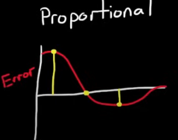
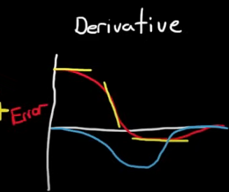
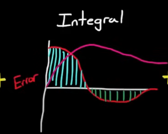

# Basic Control Theory

## Overview

This guide teaches you the basics to get your position/velocity based elevator/pivot/flywheel/extending tube  mechanisms moving accurately and covers why these systems work and are so wildly used.

**What you'll build:** A position-controlled mechanism (arm, elevator, etc.) that smoothly moves to target positions.

---

## 1. Why PID?

For this senario, let's use an elevator and model its motion using different control methods.

**Manual Control?** This switches our controls method on and keeps in on indefinetely.

```java
if (currentPosition < targetPosition) {
    motor.set(0.5); // Full speed regardless of position
}
```
This control method doesn't work for as it alwasy sets the same speed regardless of distance. In the case of our elevator, with a set speed it will keep rising past the distance you want it set too. Let's move to a new model.

**Bang-bang control?** 
This switches the our control method fully on or off depending on which side of the target you're on, solving our previous issue about the elevator "not knowing where to stop."

```java
if (currentPosition < targetPosition) {
    motor.set(1.0);  // Full speed forward
} else {
    motor.set(-1.0); // Full speed backward
}
```

However, Bang-bang control leads to jerky, abrupt movements that make it difficult to stop precisely at the target. This lack of smoothness can also increase wear on mechanical parts over time.


**PID's Smart Solution** PID control is the foundation of precise robot movement. Instead of manually setting motor speeds, PID automatically adjusts power based on where you are versus where you want to be. 

- **Far from target:** Move fast
- **Close to target:** Move slow  
- **At target:** Stop precisely
- **Overshot:** Correct automatically

**Real Benefits**
- Consistent, repeatable positioning
- Automatically adapts to load changes
- Smooth, professional-looking movement

---

## 2. How to setup a simple PID controller

### kP (Proportional) - "How far off am I?"
```java
error = target - currentPosition;
output = kP * error;
```


**What it does:** Provides power proportional to distance from target.  

The graph above shows how the output of a P controller increases linearly with the error. The farther you are from the target, the stronger the correction; as you approach the target, the output decreases, resulting in smoother stopping.

- **Large error:** High power
- **Small error:** Low power  
- **Zero error:** No power

### kD (Derivative) - "How fast am I approaching?"
```java
rateOfChange = (currentError - previousError) / deltaTime;
output = kD * rateOfChange;
```


**What it does:** Slows down as you approach the target. 
When the error changes rapidly (steep slope), the D output is high and acts to slow the system down, preventing overshoot. When the error changes slowly, the D output is small, allowing the system to approach the target smoothly.
- **Approaching fast:** Reduces power (acts like brakes)
- **Approaching slow:** Minimal effect
- **Moving away:** Adds power

### kI (Integral) - "How long have I been off?"
```java
errorSum += error * deltaTime;
output = kI * errorSum;
```



**What it does:** Eliminates steady-state error over time. 

Simplfying calculus terms, if we model the "area" of error that has occured, that increasing error over time can be multiplied by a constant to "push" our control system to reach it's position. 

- **Persistent small error:** Gradually increases power
- **At target:** Resets to zero

---

## 3. Tutorial Implementation
This tutorial covers writing introduction code that will get you started on writing/testing FRC code using commonly available hardware.

<!-- 
**TODO:** Add links to other sections of the training that demonstrate how to implement the required hardware systems (e.g., wiring, configuring CANSparkMax, setting up encoders) for a complete setup.
-->


### Basic Position Control Setup
```java
public class ArmSubsystem extends SubsystemBase {
    private final CANSparkMax motor;
    private final PIDController pidController;
    private final RelativeEncoder encoder;
    
    public ArmSubsystem() {
        motor = new CANSparkMax(1, MotorType.kBrushless);
        encoder = motor.getEncoder();
        
        // Start with these values, tune from here
        pidController = new PIDController(0.1, 0.0, 0.01);
        pidController.setTolerance(0.05); // Within 0.05 units = "at target"
    }
    
    public void setTargetPosition(double target) {
        double output = pidController.calculate(encoder.getPosition(), target);
        motor.set(output);
    }
    
    public boolean atTarget() {
        return pidController.atSetpoint();
    }
}
```

---

## 4. Step-by-Step Tuning Process

### Step 1: Start with P Only
```java
pidController = new PIDController(0.0, 0.0, 0.0);
```

1. Set kI and kD to 0
2. Gradually increase kP until the system moves toward the target
3. Keep increasing until it oscillates around the target
4. Reduce kP by 25-50% or until the system stops occilating

**Good kP signs:**
- Moves quickly to target
- Small overshoot or oscillation
- Settles near (but not exactly at) target

If your your control system settles within an error range that is acceptable for your mechanism, congrats! This is all you need to do.

If you need even greater precision and a smaller error range, continue to the next steps.

### Step 2: Add D for Smoothness
```java
pidController = new PIDController(yourKp, 0.0, 0.01);
```
**Tuning tip:** Add this if kP alone causes overshoot. Bigger values = gentler approach.

1. Start with small kD (try 10-100x smaller than kP)
2. Increase in smalle amounts until overshoot is eliminated

**Warning:** Too much kD makes response sluggish

**Good kD signs:**
- Smooth approach to target
- Little to no overshoot
- Still reaches target quickly

### Step 3: Add I for Precision (Optional)
```java
pidController = new PIDController(yourKp, 0.001, yourKd);
```

1. Only add if system doesn't reach exact target or if it feels that the system needs a small "push" to make it to target position
2. Start very small (1000x smaller than kP)
3. Increase slowly until steady-state error disappears

**Warning signs (kI too high):**
- Oscillation that gets worse over time
- Overshoot that takes long to settle

---

## 5. Real-World Example Values

### Arm Mechanism (Encoder ticks)
```java
// Example for arm rotating ~180 degrees (8192 ticks)
pidController = new PIDController(0.0005, 0.000001, 0.0001);
pidController.setTolerance(50); // 50 encoder ticks tolerance
```

### Elevator (Inches)
```java
// Example for 24-inch travel elevator
pidController = new PIDController(0.2, 0.0, 0.05);
pidController.setTolerance(0.1); // 0.1 inch tolerance
```

### Remember: These are starting points! Every mechanism is different.

---

## 6. Essential Debugging Tips

### Monitor Your Values (Smart Dashboard)
```java
@Override
public void periodic() {
    SmartDashboard.putNumber("Arm Position", encoder.getPosition());
    SmartDashboard.putNumber("Arm Target", pidController.getSetpoint());
    SmartDashboard.putNumber("Arm Error", pidController.getPositionError());
    SmartDashboard.putNumber("Arm Output", lastPIDOutput);
}
```
### Using AdvantageKit for Telemetry

```java
import org.littletonrobotics.advantagekit.AKLog;

@Override
public void periodic() {
    Logger.recordOutput("Arm/Position", encoder.getPosition());
    Logger.recordOutput("Arm/Target", pidController.getSetpoint());
    Logger.recordOutput("Arm/Error", pidController.getPositionError());
    Logger.recordOutput("Arm/Output", lastPIDOutput);
}
```
Using Advantagekit or Epilogue Annotation enables powerful real-time and post-match debugging with tools like AdvantageScope.


### Common Problems & Solutions

**Problem:** System doesn't move at all
- **Solution:** Increase kP significantly

**Problem:** Oscillates wildly around target  
- **Solution:** Reduce kP, add kD

**Problem:** Moves toward target but stops short
- **Solution:** Add small kI, or increase kP slightly

**Problem:** Overshoots and takes forever to settle
- **Solution:** Increase kD

**Problem:** Motor saturates (always at 100% power)
- **Solution:** Much smaller kP, check if target is reachable

---

## 7. Advanced Tips

### Handling Gravity (Feedforward)
```java
// For arms that fight gravity
double gravityCompensation = Math.cos(Math.toRadians(armAngle)) * 0.1;
double pidOutput = pidController.calculate(current, target);
motor.set(pidOutput + gravityCompensation);
```

### Output Limiting
```java
// Prevent violent movements
double output = pidController.calculate(current, target);
output = MathUtil.clamp(output, -0.5, 0.5); // Limit to ±50% power
motor.set(output);
```

### Multiple PID Slots
```java
// Different gains for different situations
if (holdingGamePiece) {
    pidController.setPID(0.1, 0.001, 0.02); // More aggressive
} else {
    pidController.setPID(0.05, 0.0, 0.01);  // Gentler
}
```

---

## 8. Practice Project

**Build this step-by-step:**

1. **Basic P Control** - Get mechanism moving to approximate position
2. **Add D Control** - Smooth out the movement
3. **Add I Control** - Fine-tune for precision (if needed)
4. **Add Feedforward** - Compensate for gravity/friction
5. **Integrate Commands** - Create reusable position commands

**Success criteria:**
- Reaches target within tolerance consistently
- Movement looks smooth and controlled
- Responds well to different target positions

---

## Where to Go Next

**Ready for advanced control? Explore these:**

**🎯 Advanced PID Features**
- [WPILib PID Controller](https://docs.wpilib.org/en/stable/docs/software/advanced-controls/controllers/pidcontroller.html) - Complete API reference
- [Profiled PID](https://docs.wpilib.org/en/stable/docs/software/advanced-controls/controllers/profiled-pidcontroller.html) - Velocity and acceleration limits

**🔧 System Identification**
- [SysId Tool](https://docs.wpilib.org/en/stable/docs/software/pathplanning/system-identification/index.html) - Mathematically derive optimal gains
- [Feedforward Control](https://docs.wpilib.org/en/stable/docs/software/advanced-controls/controllers/feedforward.html) - Physics-based control

**📊 State-Space Control**
- [Linear Quadratic Regulator](https://docs.wpilib.org/en/stable/docs/software/advanced-controls/state-space/state-space-intro.html) - Optimal control theory
- [Kalman Filters](https://docs.wpilib.org/en/stable/docs/software/advanced-controls/state-space/state-space-observers.html) - Sensor fusion

**⚡ Motor Controller PID**
- [Phoenix 6 PID](https://v6.docs.ctr-electronics.com/) - On-board PID control
- [REV PID](https://docs.revrobotics.com/) - SparkMax closed-loop control

---

**🚀 Ready to start tuning?** Work through the practice project with a simple mechanism, then apply these concepts to arms, elevators, shooters, and more complex systems!


**Next steps:** Advanced control theory and system identification using [WPILib's PID documentation](https://docs.wpilib.org/en/stable/docs/software/advanced-controls/introduction/index.html).