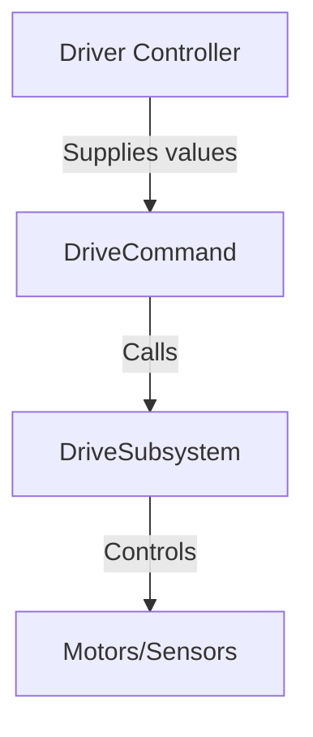

# Drive Base in FRC Programming

## Types of Drive Bases
> - **Differential(aka West Coast Drive / Tank Drive)** enables simple maneuverability using two mirrored drivetrains(sets of 2-3 wheels powered by a set of motors and gearboxes) that independently power each side of the drive base. This allows for simple yet effective manuvering with speed differences, strong pushing power, and a ease of control system implementation.

> - **Swerve drive** enables ominidirectional drivebase control, allowing robots drive in ways that typical drivebases cannot do (ie. spin in place, sideways, diagonally, drive while spinning). It has become the dominant drivebase in FRC since 2022–2023, giving teams a significant mobility advantage.

> - **Mecanum drive** is four wheel drive system in which every wheel is a "mecanum wheel"(pictured below).<!-- TODO Add mecanum wheel picture-->
This special wheel enables ominidrectional movement that includes strafing directly sideways or diagonally.

> - **H Drive** is a differential drive with an added fith wheel(usually an omniwheel) at the center of the drivebase. This extra wheel enables sideways strafe motion.

> - **Other Swerve Drives** While the most common FRC drive bases are covered above, there are several other unique or experimental designs used by teams for specific strategic advantages. **Butterfly Drive** and **Octanum Drive** are hybrid systems that allow switching between traction and omnidirectional movement—Butterfly uses omni and traction wheels, while Octanum uses mecanum and traction wheels. **Kiwi Drive** uses three omni wheels in a triangular layout for holonomic movement. **Crab Drive** mounts all wheels on steering modules so the robot can move in any direction without changing orientation, with all wheels turning together. **Ackermann Steering** mimics car-style steering with only the front wheels turning, and is rare in FRC. Teams also sometimes create custom or hybrid drives to meet unique game challenges, combining features from multiple systems or using nonstandard wheel arrangements. These drive bases are less common but demonstrate the creativity and engineering diversity found in FRC.

## Focus of This Guide

This guide will primarily focus on programming swerve drives and tank drives (also known as differential or West Coast drive). These systems are most commonly used in competition due to their versatility, performance, and prevalence in modern FRC games. The following chapters will provide detailed explanations, code examples, and best practices for implementing both swerve and tank drive systems in your robot code.

## Key Concepts Across All Drivebases
### Java Suppliers and FRC Usage

A `Supplier<T>` in Java is a functional interface that represents a function with no arguments that returns a value of type `T`. Suppliers are commonly used for deferred or dynamic value retrieval, such as reading sensor data or getting the latest state of a subsystem.

**FRC Example:**  
In FRC robot code, Suppliers are often used to pass joystick or sensor values into commands or subsystems. For example, when creating a command to drive a robot, you might use `DoubleSupplier` (a primitive specialization of `Supplier<Double>`) to provide the latest joystick input each time the command runs:

```java
// Example: Passing joystick values as suppliers to a drive command
DoubleSupplier forward = () -> driverController.getLeftY();
DoubleSupplier turn = () -> driverController.getRightX();

DriveCommand driveCommand = new DriveCommand(driveSubsystem, forward, turn);
```

This approach ensures the command always uses the most recent joystick values, making the robot responsive to operator input.

### Organization of Drive Base Subsystems, Commands, and Command Calls in FRC

In the FRC Command-Based framework, robot code is organized into subsystems and commands to promote modularity and clarity:

#### 1. **Subsystems**
A *subsystem* represents a physical part of the robot (e.g., the drive base). It contains methods to control hardware (motors, sensors) and maintains the state of that mechanism.

```java
public class DriveSubsystem extends SubsystemBase {
    // Motor controllers and sensors declared here

    public void drive(double forward, double turn) {
        // Code to set motor outputs
    }
}
```

#### 2. **Commands**
A *command* defines a specific robot action or behavior, often using one or more subsystems. For a drive base, a command might continuously read joystick values and call the drive method.

```java
public class DriveCommand extends CommandBase {
    private final DriveSubsystem driveSubsystem;
    private final DoubleSupplier forward, turn;

    public DriveCommand(DriveSubsystem subsystem, DoubleSupplier forward, DoubleSupplier turn) {
        this.driveSubsystem = subsystem;
        this.forward = forward;
        this.turn = turn;
        addRequirements(subsystem);
    }

    @Override
    public void execute() {
        driveSubsystem.drive(forward.getAsDouble(), turn.getAsDouble());
    }
}
```

#### 3. **Command Calls (Binding)**
Commands are scheduled or bound to triggers (like joystick buttons or default behaviors) in the `RobotContainer` class.

```java
driveSubsystem.setDefaultCommand(
    new DriveCommand(driveSubsystem, 
                     () -> driverController.getLeftY(), 
                     () -> driverController.getRightX())
);
```

#### **Diagram: Command-Based Structure for Drive Base**



- **Driver Controller**: Provides input (joystick values).
- **DriveCommand**: Reads input, calls drive methods.
- **DriveSubsystem**: Implements hardware control.
- **Motors/Sensors**: Physical hardware on the robot.

This structure separates hardware logic from robot behavior, making code easier to maintain and extend.


## Where to go Next?


[Swerve Control](./swerve_control.md)


[Tank Drive Control](./differential_control.md) 


## Article
Go through the following link:
> https://docs.revrobotics.com/frc-kickoff-concepts/2023/drivetrains