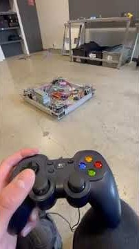
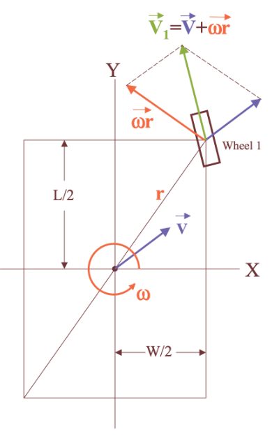
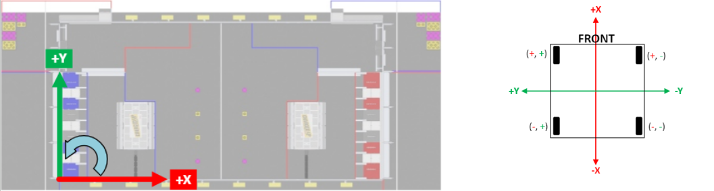
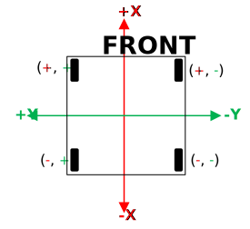

# Swerve Drive Programming Guide

## Table of Contents

1. [Introduction](#introduction)
2. [Core Concepts](#core-concepts)
3. [Mathematical Foundation](#mathematical-foundation)
4. [Additional Control Concepts](#additional-control-concepts)
5. [Coordinate Systems](#coordinate-systems)
6. [Implementation Guide](#implementation-guide)
7. [Troubleshooting](#troubleshooting)
8. [Additional Resources](#additional-resources)

## 1. Introduction
This guide covers the programming concepts needed to implement a swerve drive system using the WPILIB framework. Understanding how the your joystick inputs are turned into module commands will greatly help in debugging common programming issues associated with swerve.

>**Note:** While there are many Swerve Drive solutions that abstract much of the coding you need to do to create working swerve software such as (YAGSL, CTRE), it is recommended to learn the WPILIB way of creating swerve software. This will enable you to have more control over every part of your swerve code from joystick to motor.

>**Note:** Before starting this section, review the [Command-Based Programming Guide](./command_based_programming.md). Many concepts here rely on command-based programming principles discussed in that guide.

For a quick start, you can skip to the [Implementation Guide](#implementation-guide) to begin coding your swerve drive. However it's recommended to review sections 2–5 first for a deeper understanding.


**What You'll Learn:**
- Fundamental swerve drive concepts
- Mathematical principles behind swerve kinematics
- WPILIB implementation details
- Best practices for control systems
- Common pitfalls and solutions

## 2. Core Concepts

Below are some common terms associated with swerve drive:

### Control Definitions

* **Holonomic Drive Defininition (Swerve)**
    - Holonomic drive systems allow robots to move in any direction without being in a specific orientation, combining forward, lateral, and rotational motion simultaneously.  
    - Each wheel can rotate and steer independently
    - [Reference](https://conceptual-innovations.com/exploring-holonomic-drives-systems-with-a-deep-dive-into-halodrive/#:~:text=Holonomic%20drive%20systems%20enable%20a,lateral%20and%20rotational%20motion%20simultaneously.)

* **Trajectory Control**
    - Pre-planned or dynamically generated paths
    - Automated movement along specific routes
    - Used for autonomous navigation

* **Teleop Control**
    - Direct driver control via joysticks
    - Real-time response to input
    - Used during driver-controlled periods

### Swerve Module Components

* Each swerve module consists of:
    - **Drive Motor**: Controls wheel speed
    - **Steer Motor**: Controls wheel direction
    - **Encoder**: Provides position feedback
    - **Wheel**: The contact point with the ground

* The drive motor, steer motor, and encoder are usually team specific and require their own unique instantiation. 
    - **Drive Motor**
    - **Steer Motor**
    - **Absolute Encoder**


### Key Classes in WPILIB

#### **ChassisSpeeds**

The `ChassisSpeeds` class in relation to the swerve drive represents the desired movement of the robot as a whole. It encapsulates three components:
- **xVelocity**: Forward/backward speed (meters per second)
- **yVelocity**: Left/right speed (meters per second)
- **omegaVelocity**: Rotational speed (radians per second)

This class is commonly used as an input to swerve drive kinematics, which then calculates the necessary wheel speeds and angles for each module to achieve the desired chassis motion. By adjusting these values, you can command the robot to move in any direction and rotate simultaneously.

```java
// Stores target velocities for the entire robot
ChassisSpeeds chassisSpeeds = new ChassisSpeeds(
    xVelocity,    // Forward/backward speed (m/s)
    yVelocity,    // Left/right speed (m/s)
    omegaVelocity // Rotational speed (rad/s)
);
```

#### **SwerveModuleState**

Represents the state of an individual swerve drive module, encapsulating both its current angle (direction) and speed (velocity). By doing so, it enables coordinated control of all modules to achieve complex robot maneuvers such as strafing, rotating, and omnidirectional movement.

```java
// Stores angle and speed for individual modules
SwerveModuleState moduleState = new SwerveModuleState(
    speed,  // Speed in m/s
    angle   // Angle as Rotation2d
);
```

#### **SwerveModuleState**

Represents the state of an individual swerve drive module, encapsulating both its current angle (direction) and speed (velocity). By doing so, it enables coordinated control of all modules to achieve complex robot maneuvers such as strafing, rotating, and omnidirectional movement.

```java
// Stores angle and speed for individual modules
SwerveModuleState moduleState = new SwerveModuleState(
    speed,  // Speed in m/s
    angle   // Angle as Rotation2d
);
```

#### **SwerveDriveKinematics Object**

The `SwerveDriveKinematics` class in WPILIB is responsible for converting desired robot motion (chassis speeds) into individual swerve module states (speed and angle for each wheel). It uses the physical positions of each module relative to the robot center to perform these calculations.

* **How to create a kinematics object:**
You must specify the position of each swerve module as a `Translation2d` from the robot's center in meters.

```java
// Example: Four-module swerve drive
SwerveDriveKinematics kinematics = new SwerveDriveKinematics(
    new Translation2d(0.3, 0.3),   // Front Left
    new Translation2d(0.3, -0.3),  // Front Right
    new Translation2d(-0.3, 0.3),  // Back Left
    new Translation2d(-0.3, -0.3)  // Back Right
);
```

* Below is a simple example of converting desired robot motion into individual swerve module states using the `SwerveDriveKinematics` object:

```java
// Desired robot motion (forward, sideways, rotation)
ChassisSpeeds speeds = new ChassisSpeeds(2.0, 0.0, 1.0); // 2 m/s forward, no strafe, 1 rad/s rotation

// Convert to module states
SwerveModuleState[] states = Constants.kinematics.toSwerveModuleStates(speeds);

```

### Joystick Input to Motor Command

Joystick inputs flow down to the motors on the drivetrain using a sequence shown below. The inputs go through two "code layers" before ending up as a motor command.

**Command Layer Flowchart**

```
    A[Joystick Inputs] --> B[TeleopSwerveCommand.execute()]
    B --> C[Apply Red alliance flipping if applicable, scaling, deadbands]
    C --> D[ChassisSpeeds.fromFieldRelativeSpeeds()]
    D --> E[SwerveDrive.drive()]
```

**Drive Subsystem Flowchart**

```
    F[SwerveDrive.drive(chassisSpeeds)] --> 
    F --> G[SwerveDriveKinematics.toSwerveModuleStates()]
    G --> H[SwerveDriveKinematics.desaturateWheelSpeeds()]
    H --> I[SwerveModule.setDesiredState()]
    I --> J[SwerveModule: steerPID.calculate() & driveFeedforward.calculate() & drivePID.calculate()]
    J --> K[driveMotor.set() & steerMotor.set()]
```

## 3. Mathematical Foundation



### Coordinate Transformation

Coordinate transformation enables your FRC robot to interpret movement commands relative to the field, regardless of its current orientation. For example, during teleop, if the driver pushes the joystick forward, the robot should always move toward the opponent’s alliance wall, even if the robot is rotated or facing sideways. 

This is achieved by converting field-relative commands (from the driver’s perspective) into robot-relative wheel motions using trigonometric functions. The robot uses its gyro heading and the desired field-relative velocities to calculate the correct wheel speeds and angles, ensuring consistent and intuitive control for the driver throughout the match.

**Field-Oriented Control:**
Convert field coordinates to robot coordinates:
```
x' = x*cos(θ) + y*sin(θ)
y' = y*cos(θ) - x*sin(θ)
```

Where:
- `(x, y)` = Field-relative coordinates
- `(x', y')` = Robot-relative coordinates  
- `θ` = Robot orientation

### Inverse Kinematics

Swerve drive uses inverse kinematics to calculate individual module states from desired robot motion as shown below:



**Simple Explanation**

Imagine you have two arrows: one for how you want the robot to move (forward, sideways, or diagonally), and one for how much you want it to spin. You point each arrow with your joysticks. The longer the arrow, the stronger that movement or spin. The robot adds these arrows together to figure out which way and how fast each wheel should go. If you push the spin joystick more, the robot will turn more; if you push the move joystick more, it will drive more in that direction as reflected by the vectors.

**Vector Addition Principle:**
Each swerve module takes advantage of simple vector addition. For each module, the final velocity vector is the sum of:
1. **Translation vector** (desired robot velocity)
2. **Rotation vector** (tangent to rotation at module position)
3. **Final vector** (Summation of two vectors)


**Formula:**
```
V_module = V_translation + ω × r_module
```

Variable defining:
- `V_module` = Final module velocity vector
- `V_translation` = Desired translation velocity
- `ω` = Angular velocity
- `r_module` = Position vector from robot center to module


## 4. Additional Control Concepts

Below are some additional concepts that will help optimize your swerve drive so the modules are operating in a fashion that is kinematically feasible and taking the shortest mechanical movements to reach it's goal.

### Speed Desaturation
Speed desaturation ensures that no swerve module is commanded to exceed its physical maximum speed. When combined translation and rotation commands result in wheel speeds above this limit, all module speeds are scaled down proportionally. This maintains the intended motion direction while keeping commands achievable for the hardware.

**How it works:**  
When calculated module speeds exceed maximum velocity, all modules must be scaled proportionally. Below is the code that scales down all module speeds proportionally:

```java
public static void desaturateWheelSpeeds(SwerveModuleState[] moduleStates, double attainableMaxSpeedMetersPerSecond) {
    double recordedSpeed = 0;
    for (SwerveModuleState moduleState : moduleStates) {
        recordedSpeed = Math.max(recordedSpeed, Math.abs(moduleState.speedMetersPerSecond));
    }
    if (recordedSpeed > attainableMaxSpeedMetersPerSecond) {
        for (SwerveModuleState moduleState : moduleStates) {
            moduleState.speedMetersPerSecond =
                moduleState.speedMetersPerSecond / recordedSpeed * attainableMaxSpeedMetersPerSecond;
        }
    }
}
```

### Wheel Optimization
Wheel optimization minimizes the amount each module needs to rotate to reach its target angle. By choosing the shortest path, the module can reverse its wheel direction instead of rotating a full 180°, resulting in faster and more efficient movement.

**How it works:**  
If the angle difference between the current and target position is greater than 90°, the module reverses its speed and adds 180° to the target angle. This reduces unnecessary rotation.

```java
// Calculate angle difference
double angleDifference = targetAngle - currentAngle;

// Normalize to [-180, 180] degrees
while (angleDifference > 180) angleDifference -= 360;
while (angleDifference < -180) angleDifference += 360;

// If > 90 degrees, flip direction and reverse speed
if (Math.abs(angleDifference) > 90) {
    targetAngle += 180;
    speed *= -1;
    angleDifference += (angleDifference > 0) ? -180 : 180;
}
```

### Motor Control
Motor control ensures each swerve module accurately reaches its desired speed and angle using feedback and feedforward algorithms.

**Steering Control:**  
PID control is used to precisely position the steering motor to the target angle, correcting for any error between the current and desired position.

```java
double output = steerPID.calculate(currentAngle, targetAngle);
steerMotor.setVoltage(output);
```

**Drive Control:**  
Combines feedforward (predictive) and feedback (corrective) control to achieve the desired wheel velocity. Feedforward estimates the required output, while PID corrects for any deviation.

```java
double feedforward = driveFeedforward.calculate(targetVelocity);
double feedback = drivePID.calculate(currentVelocity, targetVelocity);
driveMotor.setVoltage(feedforward + feedback);
```

**Drive Control:**  
Combines feedforward (predictive) and feedback (corrective) control to achieve the desired wheel velocity. Feedforward estimates the required output, while PID corrects for any deviation.

```java
double feedforward = driveFeedforward.calculate(targetVelocity);
double feedback = drivePID.calculate(currentVelocity, targetVelocity);
driveMotor.setVoltage(feedforward + feedback);
```

Please reference [Simple Profiling for Swerve Drive](./Chapter_4/simple_profiling.md) for an in depth explanation on how to tune a velocity control system.
## 5. Coordinate Systems



Understanding and adhering to the WPILIB coordinate system is crucial because it ensures consistent movement commands, sensor readings, and autonomous routines across the swerve drive. Teams have frequently run into switching alliance issues/direction confusion/unreliable feild control etc. due to misunderstanding the WPILIB coordinate system.

### WPILIB Coordinate System (NWU)

**Field Coordinates:**
- **X-axis**: Points toward opponent alliance (positive = forward)
- **Y-axis**: Points to the left when facing forward  
- **Z-axis**: Points up
- **Rotation**: Counterclockwise positive, starting from +X axis

**Important Notes:**
- All components must use the same coordinate system
- Angles typically range from -180° to +180°
- Field-oriented driving maintains consistent directions regardless of robot orientation
- All units are in **Meters**

### Alliance Considerations

**Everything is in a Blue Alliance Perspective:** 🔵
- Coordinate system origin at blue alliance corner
- Positive X = toward red alliance
- Positive Y = toward left side of field


### Key Swerve Coordinate System Adjustments to keep track of
**Red Alliance Considerations:** 

Actions(Driver inputs, autonomous paths) taken on the Red Alliance side must be mirrored 

 * **Note:** Do not mirror omega turns: Omega turns are specialized maneuvers and should not be mirrored, as this may lead to unintended behavior or incorrect movement patterns.

 Below is an example of an action that must be mirrored.
```java
// Flip coordinates for red alliance in mirrored fields
if (DriverStation.getAlliance().get() == DriverStation.Alliance.Red) {
    xVelocity = -xVelocity;
    yVelocity = -yVelocity;
}
```

#### **Kinematics Considerations**

 When setting up your Kinematics object as shown below, please be aware that it is very easy to mess up assigning kinematics to swerve modules. Please ensure the order your modules are in and the location of the modules for your kinematics match the coordinate system pictured here.
 
 Teams often do a **Front Left, Front Right, Back Left, Back Right** setup. 



#### **Steering Inversion Considerations**

Depending on your mechanical setup and wiring, the direction that increases the encoder value may not match the direction that increases the motor output. If the module turns in the opposite direction of the command, you may need to add a negative sign to the output (e.g., `steerMotor.setVoltage(-output)`). This ensures the feedback loop drives the module toward the correct angle. Always verify module movement matches software commands and adjust sign as needed for your robot.


## 6. Implementation Guide

Now that you've covered what's under the hood when it comes to swerve drive. Here's a step by step implmentation guide.

We will use the CTRE implementation of motors/sensors due to its commonality. However, this setup works the same with different vendored motors/sensors. We will cover setup with different motors/sensors more in [Complete Swerve Module Class](#complete-swerve-module-class).

### Drive Constants Setup

To keep your swerve code organized and maintainable, it's best practice to centralize all drive-related constants and commonly reused objects in a dedicated file. This approach reduces the chances of duplicatate objects and makes your swerve code easier to navigate.

Follow these steps:

1. Copy the following kinematics setup into a seperate class labeled "DriveConstants."
2. Adjust the "WHEELBASE", "TRACKWIDTH" parameters as according to your swerve drive in "meters."
3. Define the swerve module order (Please reference [Kinematics Considerations](#Kinematics-Considerations)).

Kinematics explaination: [SwerveDriveKinematics Object](#swervedrivekinematics-object). 


```java
public class DriveConstants {
    // Robot dimensions (meters)
    public static final double WHEELBASE = 0.6;  // Distance between front/back wheels
    public static final double TRACKWIDTH = 0.6; // Distance between left/right wheels
    
    // Module positions relative to robot center
    public static final Translation2d FRONT_LEFT_LOCATION = new Translation2d(WHEELBASE / 2, TRACKWIDTH / 2);
    public static final Translation2d FRONT_RIGHT_LOCATION = new Translation2d(WHEELBASE / 2, -TRACKWIDTH / 2);
    public static final Translation2d BACK_LEFT_LOCATION = new Translation2d(-WHEELBASE / 2, TRACKWIDTH / 2);
    public static final Translation2d BACK_RIGHT_LOCATION = new Translation2d(-WHEELBASE / 2, -TRACKWIDTH / 2);
        
    public static final SwerveDriveKinematics KINEMATICS = 
        new SwerveDriveKinematics(
            FRONT_LEFT_LOCATION,
            FRONT_RIGHT_LOCATION,
            BACK_LEFT_LOCATION,
            BACK_RIGHT_LOCATION
        );
}
```

### Complete Swerve Module Class

Implementing a swerve module centralizes all motor, encoder, and control logic in a dedicated class. This keeps your code modular and makes it easier to tune, debug, and reuse across different robots.

Follow these steps:

1. Copy the following swerve module class into your robot project.
2. Adjust CAN IDs, gear ratios, and wheel dimensions for your hardware
3. Setup class constructor to take in all CAN IDs needed for your swerve module (drive, steer, absolute encoder)
4. Tune the PID and feedforward constants for your drivetrain. See 
 [Simple profiling](../Chapter_4/simple_profiling.md) for more in depth on tuning velocity control systems.
5. Ensure encoder readings and motor outputs match your mechanical setup (see [Steering Inversion Considerations](#steering-inversion-considerations)).


Key features:
- Encapsulates drive and steer motor control
- Uses PID and feedforward for precise movement
- Optimizes wheel rotation for shortest path
- Converts encoder readings to physical units

Reference: [Motor Control](#motor-control), [Steering Control](#motor-control), [Drive Control](#motor-control), [Wheel Optimization](#wheel-optimization)

```java
public class SwerveModule {
    private final TalonFX driveMotor;
    private final TalonFX steerMotor;
    private final CANcoder steerEncoder;

    private final PIDController steerPID;
    private final SimpleMotorFeedforward driveFeedforward;
    private final PIDController drivePID;

    // Constants (replace with your actual values)
    private static final double DRIVE_GEAR_RATIO = 6.75;
    private static final double WHEEL_CIRCUMFERENCE = 0.1016 * Math.PI; // 4" wheel in meters

    public SwerveModule(int driveID, int steerID, int encoderID) {
        driveMotor = new TalonFX(driveID);
        steerMotor = new TalonFX(steerID);
        steerEncoder = new CANcoder(encoderID);

        driveMotor.setNeutralMode(NeutralModeValue.Brake);
        steerMotor.setNeutralMode(NeutralModeValue.Brake);

        steerPID = new PIDController(1.0, 0.0, 0.0);
        steerPID.enableContinuousInput(-Math.PI, Math.PI);

        drivePID = new PIDController(0.1, 0.0, 0.0);
        driveFeedforward = new SimpleMotorFeedforward(0.1, 2.0);
    }

    public void setDesiredState(SwerveModuleState desiredState) {
        // Optimize the reference state to avoid spinning > 90 degrees
        SwerveModuleState state = SwerveModuleState.optimize(
            desiredState, new Rotation2d(getSteerAngle()));

        // Calculate steering output
        double steerOutput = steerPID.calculate(
            getSteerAngle(), state.angle.getRadians());
        steerMotor.set(steerOutput / 12.0); // TalonFX expects [-1, 1] for percent output

        // Calculate drive output
        double driveFF = driveFeedforward.calculate(state.speedMetersPerSecond);
        double driveFB = drivePID.calculate(
            getDriveVelocity(), state.speedMetersPerSecond);
        driveMotor.set((driveFF + driveFB) / 12.0); // Convert voltage to percent output
    }

    public SwerveModuleState getState() {
        return new SwerveModuleState(
            getDriveVelocity(),
            new Rotation2d(getSteerAngle())
        );
    }

    private double getSteerAngle() {
        // CANcoder returns [0,1) rotations, convert to radians
        return steerEncoder.getAbsolutePosition().getValue() * 2 * Math.PI;
    }

    private double getDriveVelocity() {
        // TalonFX velocity is in rotations per second, convert to m/s
        double rotationsPerSecond = driveMotor.getVelocity().getValue();
        return rotationsPerSecond * WHEEL_CIRCUMFERENCE / DRIVE_GEAR_RATIO;
    }
}
```


### Basic Swerve Drive Subsystem Structure

This subsystem serves as the central hub for swerve drive control. It receives commands from the drive controller, manages the coordination of all swerve modules, and ensures each module moves as needed to execute the requested driving actions. Within this subsystem, you instantiate your gyro and swerve modules, then handle all command and feedback operations for swerve movement.

Follow these steps:
1. Copy the following swerve drive subsystem into your robot project.
2. Ensure the module array order matches your kinematics setup (see [Kinematics Setup](#kinematics-setup)).
3. Adjust CAN IDs and constants as needed for your hardware. Ensure the parameters align with what you defined in your swerve module class.


Topics covered: [SwerveDriveKinematics Object](#swervedrivekinematics-object), [SwerveModuleState](#swervemodulestate), [ChassisSpeeds](#chassisspeeds), [Speed Desaturation](#speed-desaturation), [Wheel Optimization](#wheel-optimization)


```java
public class SwerveDrive extends SubsystemBase {
    private final SwerveModule[] modules;
    private final SwerveDriveKinematics kinematics;
    private final Gyro gyro;

    public SwerveDrive() {
        // Initialize modules in the same order as kinematics
        modules = new SwerveModule[] {
            new SwerveModule(1, 2, 11), // Front Left
            new SwerveModule(3, 4, 12), // Front Right
            new SwerveModule(5, 6, 13), // Back Left
            new SwerveModule(7, 8, 14)  // Back Right
        };

        // Reference kinematics from DriveConstants
        kinematics = DriveConstants.KINEMATICS;

        // Instantiate gyro (CTRE Pigeon2 example)
        gyro = new Pigeon2(0); // CAN ID 0, change as needed
    }

    public void drive(ChassisSpeeds chassisSpeeds) {
        // Convert chassis speeds to module states
        SwerveModuleState[] moduleStates =
            kinematics.toSwerveModuleStates(chassisSpeeds);

        // Desaturate wheel speeds to max allowed
        SwerveDriveKinematics.desaturateWheelSpeeds(
            moduleStates, DriveConstants.MAX_SPEED_MPS);

        // Command each module to its desired state
        for (int i = 0; i < modules.length; i++) {
            modules[i].setDesiredState(moduleStates[i]);
        }
    }


    public SwerveModuleState[] getModuleStates() {
        return Arrays.stream(modules)
            .map(SwerveModule::getState)
            .toArray(SwerveModuleState[]::new);
    }

    public Rotation2d getRotation2d() {
        // Get robot heading from gyro
        return gyro.getRotation2d();
    }
}
```

### Teleop Command Implementation

This command handles real-time driver input and translates joystick values into swerve drive commands. It applies alliance flipping, deadbands, and scaling, then generates field-relative chassis speeds for the drive subsystem.

Follow these steps:
1. Copy the following teleop command class into your robot project.
2. Connect joystick axes to the suppliers (`xSupplier`, `ySupplier`, `rotSupplier`).
3. Ensure alliance flipping logic matches your team's requirements.
4. Adjust deadband and scaling constants as needed.

Topics covered: [Joystick Input to Motor Command](#joystick-input-to-motor-command), [ChassisSpeeds](#chassisspeeds), [Alliance Considerations](#alliance-considerations)

```java
public class TeleopSwerveCommand extends CommandBase {
    private final SwerveDrive swerve;
    private final Supplier<Double> xSupplier;
    private final Supplier<Double> ySupplier;
    private final Supplier<Double> rotSupplier;

    public TeleopSwerveCommand(
        SwerveDrive swerve,
        Supplier<Double> xSupplier,
        Supplier<Double> ySupplier,
        Supplier<Double> rotSupplier
    ) {
        this.swerve = swerve;
        this.xSupplier = xSupplier;
        this.ySupplier = ySupplier;
        this.rotSupplier = rotSupplier;
        addRequirements(swerve);
    }

    @Override
    public void execute() {
        // Get joystick inputs via suppliers
        double xSpeed = -ySupplier.get();  // Forward/backward
        double ySpeed = -xSupplier.get();  // Left/right
        double rot = -rotSupplier.get();   // Rotation

        // Alliance flip for red side
        if (AllianceFlipUtil.shouldFlipToRed()) {
            xSpeed = -xSpeed;
            ySpeed = -ySpeed;
        }

        // Apply deadband and scale to max speeds
        xSpeed = Math.abs(xSpeed) > XboxInterfaceConstants.kDeadband
            ? xSpeed * DriveConstants.MAX_SPEED_MPS
            : 0.0;
        ySpeed = Math.abs(ySpeed) > XboxInterfaceConstants.kDeadband
            ? ySpeed * DriveConstants.MAX_SPEED_MPS
            : 0.0;
        rot = Math.abs(rot) > XboxInterfaceConstants.kDeadband
            ? rot * DriveConstants.MAX_ANGULAR_SPEED_RAD_PER_SEC
            : 0.0;

        // Create chassis speeds (field-oriented)
        ChassisSpeeds chassisSpeeds = ChassisSpeeds.fromFieldRelativeSpeeds(
            xSpeed, ySpeed, rot, swerve.getRotation2d()
        );

        // Drive the robot
        swerve.drive(chassisSpeeds);
    }
}
```

### Integrating Swerve Drive in RobotContainer

To connect your swerve drive subsystem and teleop command to the overall robot structure:
1. Instantiate both objects in your `RobotContainer` class. 
2. Your `TelopSwerveCommand` should be instantiated as a `default command` so that it is running continously.

**Example RobotContainer Setup:**

```java
public class RobotContainer {
    // Subsystems
    private final SwerveDrive swerveDrive = new SwerveDrive();

    // Joystick
    private final CommandXboxController driverController = new CommandXboxController(0);

    // Teleop command
    private final TeleopSwerveCommand teleopSwerveCommand = new TeleopSwerveCommand(
        swerveDrive,
        () -> driverController.getLeftX(),
        () -> driverController.getLeftY(),
        () -> driverController.getRightX()
    );

    public RobotContainer() {
        configureBindings();
    }

    private void configureBindings() {
        // Set default command for swerve drive
        swerveDrive.setDefaultCommand(teleopSwerveCommand);
    }
}
```

**Key Steps:**
- Instantiate the `SwerveDrive` subsystem.
- Create the teleop command, passing joystick axis suppliers.
- Set the teleop command as the default for the swerve subsystem.
- Place all subsystem and command instantiations in `RobotContainer` for centralized management.

This structure ensures your swerve drive responds to joystick input during teleop and is ready for further autonomous command integration.

## 7. Troubleshooting

### Common Issues and Possible fixes

**Motors not reciving command input from controller**
- Trace back your logic and add printlns at each step to see where your code logic stops working

**Module Not Reaching Target Angle**
- Check encoder calibration and offset values
- Verify PID tuning parameters
- Ensure continuous input is enabled for angle PID

**Robot Drifting During Movement**
- Calibrate gyroscope properly
- Check for mechanical issues (loose wheels, etc.)
- Verify coordinate system consistency

**Jerky or Unstable Movement**
- Reduce PID gains, especially derivative
- Add input filtering/deadbands
- Check for sensor noise

**Modules Fighting Each Other**
- Ensure all modules use same coordinate system
- Verify kinematics setup matches physical layout
- Check for inverted motors or encoders

### Debug Tools

**Module State Monitoring:**
```java
public void updateTelemetry() {
    for (int i = 0; i < modules.length; i++) {
        SwerveModuleState state = modules[i].getState();
        SmartDashboard.putNumber("Module " + i + " Speed", state.speedMetersPerSecond);
        SmartDashboard.putNumber("Module " + i + " Angle", state.angle.getDegrees());
    }
}
```

**Field-Relative Position Tracking:**
```java
private final SwerveDriveOdometry odometry;

public void updateOdometry() {
    odometry.update(gyro.getRotation2d(), getModuleStates());
    SmartDashboard.putString("Robot Pose", odometry.getPoseMeters().toString());
}
```

### Best Practices

1. **Start Simple**: Begin with basic teleop control before adding autonomous features
2. **Test Incrementally**: Test each module individually before running full swerve
3. **Monitor Performance**: Always log module states and robot pose for debugging
4. **Consistent Units**: Use meters and radians throughout for consistency with WPILIB

## 9. Reference Resources

- [WPILIB Swerve Drive Documentation](https://docs.wpilib.org/en/stable/docs/software/kinematics-and-odometry/swerve-drive-kinematics.html)
- [SwerveLib by Team 5190](https://github.com/5190GreenHopeRobotics/5190-Library)

---

*This guide is based on Team 2637's swerve drive training presentation and includes additional implementation details for new programmers.*