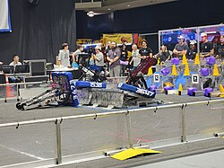
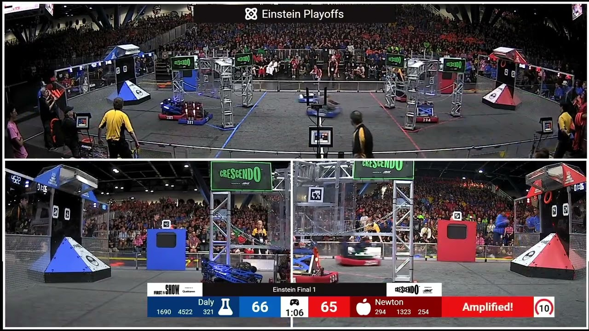

# **FRC Autonomous Programming - Strategy and Planning**

## Overview

This guide teaches you the strategic foundation and planning principles for designing high-performance autonomous routines for FRC robots, covering game analysis, alliance coordination, and decision-making frameworks.

> **Note:** This guide utilizes many Command-Based Programming concepts. For a solid foundation, please review the [Command-Based Theory](../command_based_theory.md) training before proceeding.

**What you'll build:** A strategic framework for autonomous planning that maximizes competitive advantage and adapts to different match scenarios.

---

## 1. Why Autonomous Matters?

For competitive FRC teams, autonomous mode is often the difference between winning and losing matches.

**Simple Drive Straight Acroos the starting line?** Most seasons, a game will award you points for simply crossing a starting line. Many teams often forget about these easy to earn points can make or break matches. Below is an example of a simple drive foward auto.

```java
// Basic mobility - just drive forward
public Command getMobilityAuto() {
    return new DriveForward(driveSubsystem, 3.0); // Drive 3 meters
}
```
**Static Autonomous?** Extra points are often available for scoring in autonomous. Below is an example of an autonomous that takes advantage of the extra points by adding onto their simple drive foward command.

```java
// Static preload scoring
public Command getPreloadAuto() {
    return new SequentialCommandGroup(
        new ScorePreload(superstructure),
        new DriveForward(driveSubsystem, 3.0)
    );
}
```

However, as teams are looking to increase their leverage in alliance meetings and matchups, static autonomous routines can't adapt to alliance partners, field conditions, or strategic needs that change throughout a competition.

**Strategic Autonomous** Autonomous routines designed around game analysis, alliance coordination, and robust execution provide:

- **Maximum point potential:** Score multiple game pieces efficiently whilist not overbearing on robot capability.
- **Strategic positioning:** End in advantageous locations for teleop. (ie. getting into the closest position to the loading station)
- **Alliance coordination:** Complement rather than conflict with partners (ie. Having multiple autos that can start from different positions or take different routes)
- **Tiebreaker advantage:** Auto points often determine close matches
- **Consistent execution:** Work reliably across different field conditions.

**Real Benefits** Teams who are able to checkmark the above in autonomous can have:
- Significant competitive advantage in qualification matches
- Higher alliance selection value during top alliance scouting meetings
- Better playoff performance through coordination with alliance partners

---
> **Note:**  
> **Alliance Partner Roles in FRC:**
> - **Alliance Captain:** Highest-seeded team; leads alliance strategy and usually runs the most complex/high-scoring autonomous routine.
> - **First Pick:** Chosen first by the captain; expected to execute a strong, complementary autonomous routine that aligns with the captain’s plan.
> - **Second Pick:** Chosen second; often focuses on reliability, easy points (like mobility), or supporting roles to avoid conflicts and assist primary scorers.
>
> *Tip:* Plan autonomous routines with your likely alliance role in mind. Captains and first picks coordinate for maximum scoring, while second picks prioritize reliability and support. Having flexible routines for each role increases your team’s strategic value.

---

## 2. Autos Strategic Foundation

### Game Analysis - "What should we accomplish?"
Before writing any code, analyze what autonomous can achieve and work with the strategy subunit of your team to go over the following points:

**Key Questions:**
- What bonus points are available only during autonomous?
- What role can our team's robot realistically play in playoff matches and qualificaitons?
- How do autonomous points compare to teleop scoring rates?
- What field positioning advantages exist?

### Alliance Considerations - "Who are we playing with?"

Autonomous routines play different roles during Qualification and Playoff matches. Here are some considerations to make about both types of matches when writing your routines.

**Qualification Matches:**
- Always assume most alliance partners will provide minimal coordination during alliance meetings
- Design routines that maximize your individual contribution
- Avoid areas where robot conflicts are likely

**Playoff Matches:**  
- Playing with skilled, coordinated alliance partners
- Design complementary routines (who does what?)
- Enable multiple strategic options


**Example Analysis (2023 Charged Up):**
```
Mobility: 3 points (auto only)
Game pieces: 3-6 points depending on level  
Balance: 8-12 points depending on robot count
```
Alliance Captain + 1st Pick autos revolved around using their mobility to manuver around the "Charge Station" and score pieces (2-3 typically) that were not in a straight line. They aimed for scoring cone game pieces at the highest rung before moving down to gain the max potential auto points.

Second pick autos focused on reliably balancing on the Charge Station for extra points, ensuring compatibility with alliance partners even if their maneuverability was limited.

> For official rules and scoring details, see the [2023 FRC Game Manual](https://firstfrc.blob.core.windows.net/frc2023/Manual/2023FRCGameManual.pdf).




**Example Analysis (2024 Crescendo):**
```
Mobility: 2 points (auto only)  
Amp Note: 2 points (auto only, scored in Amp)  
Speaker Note: 5 points (auto only, scored in Speaker)  
```
> For official rules and scoring details, see the [2024 FRC Game Manual](https://firstfrc.blob.core.windows.net/frc2024/Manual/2024GameManual.pdf).

Alliance Captain + 1st Pick autos typically focused on collecting and scoring multiple Notes in the Speaker, often starting with a preload and then picking up additional gamepieces at the center of the feild that could potentially be stolen by the other alliance. Advanced routines included coordinated paths to avoid collisions and maximize scoring.

Second pick autos prioritized reliable mobility and collecting game pieces that were closer to them. These routines emphasized consistency and compatibility, ensuring they did not interfere with primary scorers that mostly focused on the stealable outside gamepieces.




---

## Strategic Planning Template Planning Guide

### Phase 1: Game Analysis
1. **Rule Study** - Analyze current game manual for autonomous opportunities
2. **Point Calculation** - Determine theoretical maximum autonomous scores
3. **Timing Analysis** - Break down mechanism and movement times
4. **Competition Research** - Study what top teams accomplished in autonomous

### Phase 2: Strategic Planning
1. **Option Development** - Create 3-5 different autonomous routine concepts
2. **Alliance Scenarios** - Plan for different partnership situations
3. **Risk Assessment** - Evaluate reliability vs. scoring potential
4. **Prioritization** - Rank routines by strategic value

**Success Criteria:**
- Clear understanding of autonomous scoring opportunities
- Documented timing analysis for all major actions
- Multiple autonomous options for different scenarios
- Strategic reasoning for each autonomous choice

---

## Where to Go Next

**Ready for implementation? Continue with:**
- **[FRC Autonomous Programming - Implementation](./writing_autos.md)** – Technical implementation of your strategic plans


---


